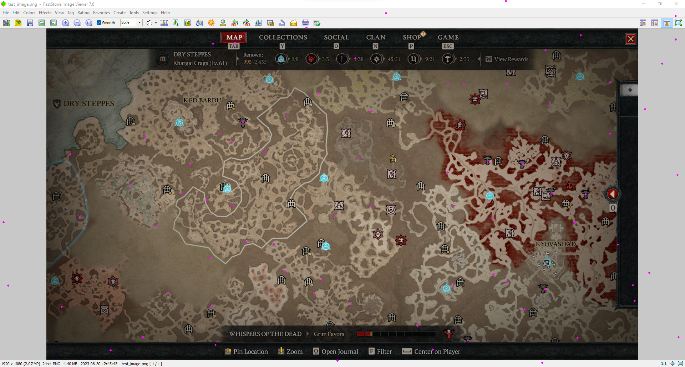

# Diablo IV: Altar of Lilith Map Overlay

## Example

https://github.com/mxtsdev/d4-map-overlay/assets/58796811/60e0b2e6-d607-4e63-b75a-e0d90d177b84

## How-to instructions

Create a Python3 enviroment (I recommend using https://www.anaconda.com/download on Windows)

pip install -r requirements.txt

python .\d4-altar-overlay.py
